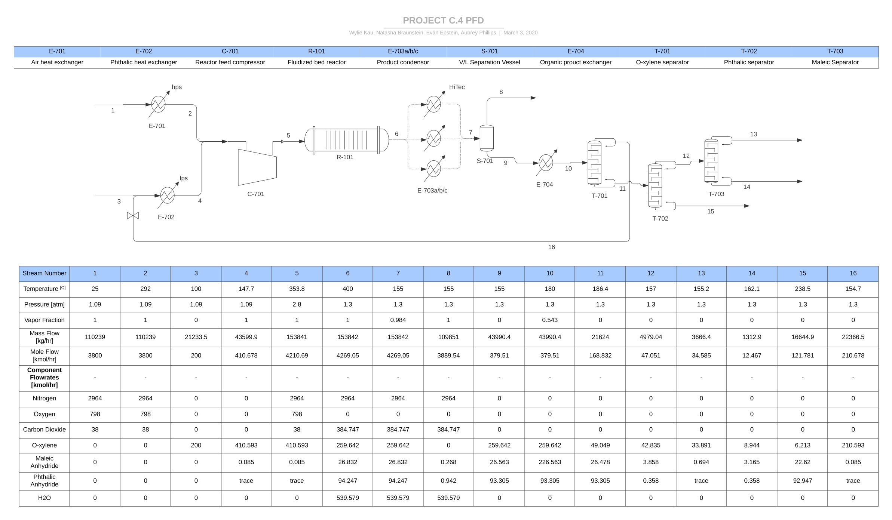
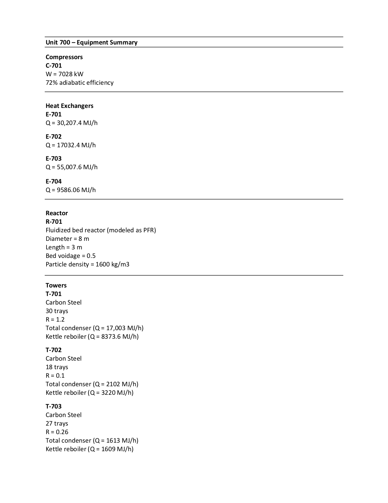
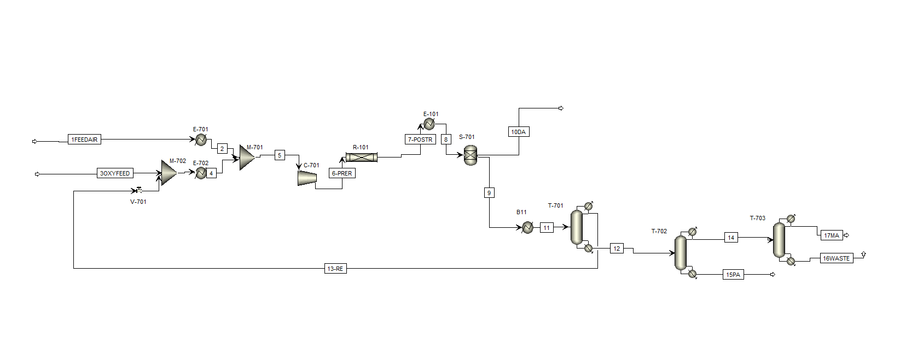
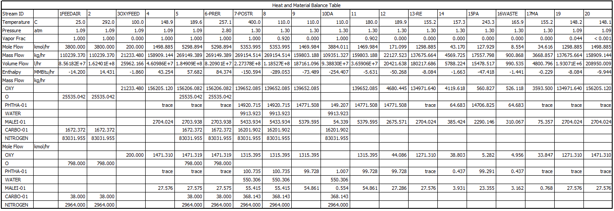

# PFD - CHEME 485 Final Project
 Contributors: Natasha Braunstein, Aubrey Phillips, Evan Epstein, and Wylie Kau

 *We are fully aware that many aspects of our simulation do not align with project goals. We will soon be optimizing to meet purity standards, as we were stalled by troubleshooting a tricky reactor and are currently working to integrate a functional recycle stream, which has changed our separation needs. As such, once we have a finalized simulation we can fully flush out equipment summaries (e.g. knowing final heat duty for heat exchangers) and proceed with cost projections. We are re-defining separation system parameters to achieve product specifications.*

## PFD

## Equipment Summary

## Aspen Simulation and Stream Table

Current simulation file can be found at 'PFD/O_Xylene_plant_v3.apw'
