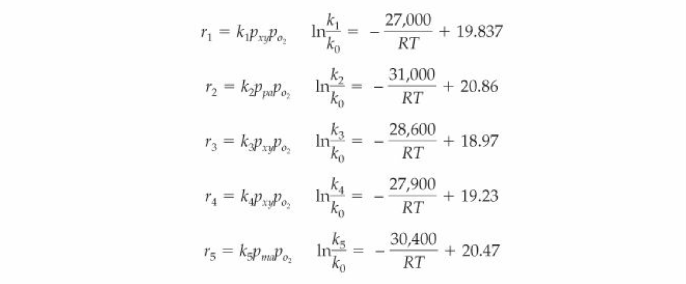

# Reaction Kinetics

The following reaction kinetics are valid between 300-400 C and between 1-3 atm. 

- The first reaction is the conversion of o-xylene and oxygen gas to phthalic anhydride.

- The second reaction is the combustion of phthalic anhydride.
- The third reaction is the combustion of o-xylene.
- The fourth reaction is the conversion of o-xylene and oxygen gas to maleic anhydride, water, and carbon dioxide.

- The fifth reaction is the combustion of maleic anhydride.

The reaction rates are measured in kmol/(hr kgcatalyst). Partial pressures are in atmospheres and temperature is in Kelvin. k_0 = 1 kmol/(hr kgcatalyst atm^2). A relevant value of R is 1.987 cal/(K mol).

The reaction rates are given below:

The activation energies are as follows, given in units of cal/mol:
- Reaction 1: 27,000
- Reaction 2: 31,000
- Reaction 3: 28,600
- Reaction 4: 27,900
- Reaction 5: 30,400

Other important note regarding reactivity:
- The concentration of o-xylene must not be between 1-6 mol% or above 10 mol%.
