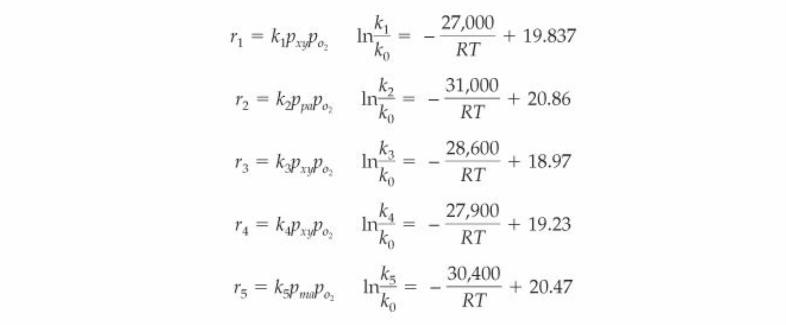

# Planning Report - CHEME 485 Final Project
 Contributors: Natasha Braunstein, Aubrey Phillips, Evan Epstein, and Wylie Kau

### Project Overview

In this project, we are performing preliminary process design in order to scale a Phthalic anhydride production process to a 100,000 metric ton per year based on utilizing o-xylene as the raw feedstock material. Utilizing a new catalyst that minimizes side reactions and eliminates carbon monoxide production, a grassroots facility has been proposed for the scaled process.

The process will be fed air and pure o-xylene (OX) to form Phthalic anhydride (PA), Maleic anhydride (MA), water, and carbon dioxide (CO2). OX and air streams are prepped and fed to a catalytic bed reactor (type TBD) where exothermic reaction of raw feed materials will occur, competing with exothermic combustion of desired products PA and MA. The reactor product stream will be fed to 1 of a set of 3 specialized condenser units for desublimation. While one condenser is operating, the second will be on standby, while the third will be melting the desublimated products, the condenser units rotating between operating modes. The condenser stage product will be a V-L stream with a MA/PA rich liquid and a MA/PA poor vapor containing the rest of the non-condensables (CO2, water, and air). The liquid stream will be sent to a series of two distillation columns for separation and the vapor ("dirty air") will be sent to waste treatment.

*The grassroots facility and process will be designed in accordance with the following targets: *
- 100,000 metric tons/yr Phthalic anhydride produced
- 99.9 wt% Phthalic anhydride purity
- 95.0 wt% Maleic anhydride purity

### Block Flow Diagram and Mass Balance

__Insert BFD Here__

### Reaction Kinetics

The following reaction kinetics are valid between 300-400 C and between 1-3 atm.

- The first reaction is the conversion of o-xylene and oxygen gas to phthalic anhydride and water.

- The second reaction is the combustion of phthalic anhydride.
- The third reaction is the combustion of o-xylene.
- The fourth reaction is the conversion of o-xylene and oxygen gas to maleic anhydride, water, and carbon dioxide.

- The fifth reaction is the combustion of maleic anhydride.

The reaction rates are measured in kmol/(hr kgcatalyst). Partial pressures are in atmospheres and temperature is in Kelvin. k_0 = 1 kmol/(hr kgcatalyst atm^2). A relevant value of R is 1.987 cal/(K mol).

The reaction rates are given below:

The activation energies are as follows, given in units of cal/mol:
- Reaction 1: 27,000
- Reaction 2: 31,000
- Reaction 3: 28,600
- Reaction 4: 27,900
- Reaction 5: 30,400

This data can be inputted into a level 2 reactor simulation to determine the conversions under different temperature and pressure conditions.

Other important note regarding reactivity:
- The concentration of o-xylene must not be between 1-6 mol% or above 10 mol%.

### Thermodynamics Package

The Soave-Redlich-Kwong (SKR) cubic equation of state will be used for all simulations.
According to Aspen, SKR gives reasonable results for all temperatures and pressures and
is best for nonpolar or mildly polar mixtures such as hydrocarbons and light gases.
This matches up well with the reactions in the phthalic anhydride plant as o-xylene is a
hydrocarbon, oxygen is a light gas, phthalic anhydride and maleic anydride are mildly polar,
and CO2 is a light gas.

### Preliminary Cost Estimate

The cost estimate below is based on the raw material costs and product profit. Amounts are based on the Mass balance above.

