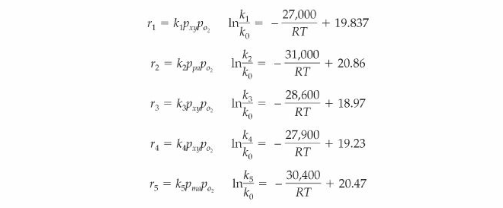

# Catalytic Bed Reactor Optimization - CHEME 485 Final Project
Contributors: Natasha Braunstein, Aubrey Phillips, Evan Epstein, and Wylie Kau

The reaction rates are provided in the problem statement:

where reaction 1 is the conversion of o-xylene (OXY) to phthalic anhydride (PA), the desired product, reaction 4 is the conversion of o-xylene to maleic anhydride (MA), a side-product, and reactions 2, 3, and 5 are combustion reactions of PA, OXY, and MA, respectively.

The reactions were reorganized to find the rates of appearance of every component of the system. The rates of appearance represent the change in component flow rate with mass of catalyst in the reactor. A Python script was used to solve the set of ODE's comprising these rates using a basis of 1000kmol/hr total inlet flow rate and select initial mole fractions indicative of the problem statement:

The flow rates reach a maximum point and plateau when the o-xylene runs out. The rates of change are impacted differently by changes in pressure and temperature - the process above was repeated for temperatures between 573.15K and 673.15K and pressures between 1 and 3 atm, constraints inherent to the catalyst.
